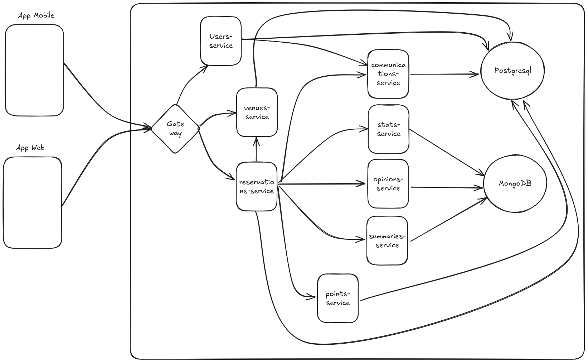

# Back-end Chefcito 

## Tecnologias

El sistema se desarrolla utilizando Python (3.12) y FastAPI (0.111.0) como lenguaje 
de programacion principal y framework principal. En el caso de que se requiera construir
algun servicio para el cual no hay librerias o frameworks compatibles con estas versiones
se desarrollara tal servicio utilizando Golang (1.22).

### Herramientas de desarrollo

Los servicios del sistema seran contenerizados utilizando una solucion de contenederos que
sea compatible con el Standard OSI y los archivos de contenedores llevaran el nombre de
**CONTAINERFILE**.
Para la construccion de un entorno de desarrollo local se utilizara Docker-Compose o bien
alguna herramienta que permita crear un cluster de un unico nodo de Kubernetes. El sistema
productivo estara deployeado sobre Kubernetes y se utilizara Terraform como herramienta
de gestion de la infraestructura.

#### Chefcito-CLI

Chefcito cli es un programa de consola que facilita la tarea de desarrollo local del sistema en general. 

##### Instalacion
Previo a la la instalacion de chefcito instalar Poetry ejecutando el siguiente comando:

```bash
pip install poetry
```

Ejecutar el siguiente comando:

```bash
cd scripts/chefcito-cli && poetry build && pip install --user dist/chefcito_cli-0.1.0-py3-none-any.whl
```

##### Uso de chefcito

Para hacer uso de chefcito, es necesario que el working directory sea el root del proyecto.

- chefcito build
    - Construye todos los contenedores de los servicios
- chefcito up
    - Realiza el deploy de los servicios en el entorno local
- chefcito down
    - Destruye los contenedores del entorno local
- chefcito run
    - equivalente a ejecutar build seguido de up
- chefcito install
    - instala todas las dependencias de chefcito (tanto dev-requierements.txt como requirements.txt)
 - chefcito load-db --from-file db_config.yaml
    - Carga los permisos definidos en db_config.yaml en la base de datos de users local

### Repositorios

El repositorio del sistema se encontrara alojado en [github](github.com), utilizando la herramienta
*git* y contando el mismo con la siguiente estructura de carpetas:

- src
    - services
        - Contiene un modulo por servicio construido que implementan al servicio integrado con la interfaz de FastAPI.
    - model
        - Contiene modulos y archivos de codigo que implementan la logica de cada uno de los servicios. Todo modelo de servicio tiene que contener
          un modulo service que implemente la interfaz del propio servicio.
- test
    - Contiene todas las pruebas unitarias de los servicios en *src*, utiliza la misma misma estructura de modulos que *src*
- containerfiles
    - Contiene todos los archivos de Contenedores del sistema, cada contenedor construye una imagen de un unico servicio del 
    sistema.
- README.MD
    - Contiene informacion importante del sistema, como puede ser la forma en la que esta construido, la utilizacion del mismo para levantar
    un ambiente local de desarrollo y la forma de ejecutar el sistema como un servicio en la nube.
- requirements.txt
    - Contiene todos los requerimientos de librerias del sistema.
- dev-requirements.txt
    - Contiene los requerimientos de librerias que no forman parte del sistema pero cumplen algun rol en el desarrollo del mismo.

### Dev Guidelines

#### Agregado de un nuevo servicio

Para agregar un nuevo servicio a Chefcito, se tiene que seguir el siguiente flujo de desarrollo:

1. Crear una nueva rama con el nombre del servicio a crear
2. Construir el nuevo servicio
3. Abrir un pull request y validarlo
4. Mergear el nuevo servicio a main
5. Eliminar la rama del servicio

#### Agregado de una nueva funcionalidad para un servicio existente

En este caso, el flujo es el mismo que para el punto anterior, con la excepcion de que la rama tiene que tener el siguiente formato:

- NobreServicio-Funcionalidad

#### Agregado de nueva funcionalidad a chefcito-cli

En este punto se puede o bien crear una nueva rama, o bien desarrollar la funcionalidad sobre una rama existente. Al momento de pedir un pull-request si la funcionalidad es stand alone, no se requiere validacion para realizar el merge.

#### Bug fix no critico

Cuando el Bug que se intenta agregar no es un bug critico (no impide el funcionamiento del sistema o gran parte del mismo) el flujo de desarrollo es el mismo que para una nueva funcionalidad. El Pull request debe contener, ademas, al menos una prueba en la que se evidencie el Bug.

#### Bug Fix Critico

Se debe seguir el mismo flujo que para un bug fix no critico, con la salvedad de que no se requiere de validacion para mergear el mismo a main.


## Diagrama general del sistema



## Despliegue utilizando Github Actions

Existen dos pipelines de github actions definidos para este repositorio.
El primero; *python-test* se ejecuta siempre que se realice un pull
request de chefcito a main y siempre que modifique la rama main.
El segunndo; *deploy* se ejecuta unicamente cuando se modifica la rama main del repositorio.

#### Python test

Este primer pipeline ejecuta los tests del sistema y despliega las imagenes de los servicios
en el container registry de staging.
Para que este pipeline se ejecute correctamente es necesario configurar los siguientes secretos:

1. GATEWAY_REGISTRY_USERNAME
2. GATEWAY_REGISTRY_PASSWORD

estos corresponden al username del container registry y la contraseña del mismo.
Para obtener los mismos desde un *Azure Container Registry* se debe:

1. Ingresar al registry desde la consola.
2. Ir a Settings >> Access keys
3. Copiar el *Username* y definir el valor de GATEWAY_REGISTRY_USERNAME
4. Copiar o bien *password* o bien *password2* y definir el valor de GATEWAY_REGISTRY_PASSWORD

#### Deploy

Este segudo pipeline se encarga de realizar el despliegue de las imagenes de docker al registry
para produccion y de redesplegar los *Container Apps* sobre los cuales se ejecutan los servicios 
de chefcito.

En este caso, hay que configurar, ademas, el siguiente secreto:

1. AZURE_CCREDENTIALS

este secreto es un JSON con el siguiente formato:

```json
{
    "clientSecret":  "******",
    "subscriptionId":  "******",
    "tenantId":  "******",
    "clientId":  "******"
}
```

A continuacion se detalla como obtener cada uno de estos datos:

1. ClientSecret y ClientID 
    - Estos valores se obtienen de la App Registration creada
    para poder ejecutar el pipeline de infraestructura, como 
    se explica en [este otro repositorio](https://github.com/Chefcito-Comidas/infra)
2. SubscriptionID 
    - En la consola de Azure ir a Subscriptions y copiar el 
    ID de la subscripcion sobre la cual se va a desplegar el
    sistema.
3. TenantID
    - Ir a App registrations, seleccionar la aplicacion creada
    y desde la pantalla de overview, copiar el Directory (tenant) ID.


